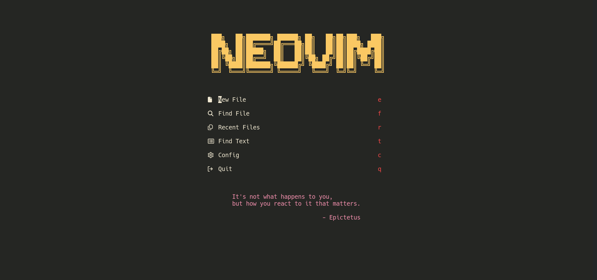
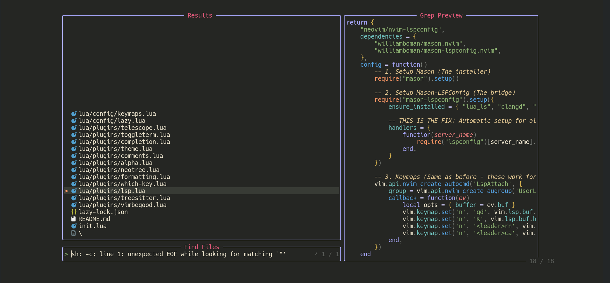
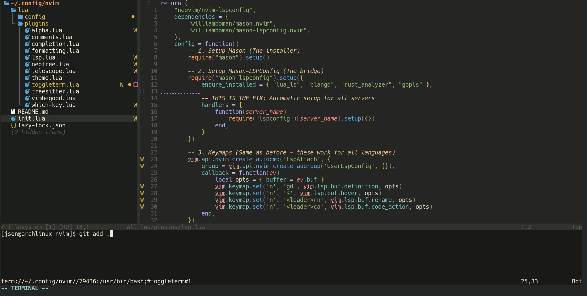

# Neovim Configuration

A personalized, high-performance Neovim configuration built for efficiency in C++, Rust, and Go development. This setup utilizes `lazy.nvim` for package management and includes a curated suite of plugins for a modern IDE experience.


- **Home Page:** 
- **Fuzzy Finder:** 
- **Workspace View:** 

## Installation

```bash
# 1. Backup existing config
mv ~/.config/nvim ~/.config/nvim.bak

# 2. Clone repository
git clone git@github.com:yi-json/nvim.git ~/.config/nvim

# 3. Start Neovim (Plugins will install automatically)
nvim
```

##  Plugin Reference

This configuration is modular. Each file in `lua/plugins/` controls a specific aspect of the editor.

| File | Plugin / Feature | Description |
| :--- | :--- | :--- |
| **`alpha.lua`** | **Dashboard** | The startup screen with the "NEOVIM" header, shortcuts, and philosophical quotes. |
| **`comments.lua`** | **Comment.nvim** | Smart commenting utility. Toggle comments with `gcc` (line) or `gc` (selection). |
| **`completion.lua`** | **nvim-cmp** | Autocompletion engine. Provides suggestions for code, paths, and snippets as you type. |
| **`formatting.lua`** | **Conform / None-ls** | Handles auto-formatting (e.g., clang-format, rustfmt) to keep code consistent. |
| **`lsp.lua`** | **LSP Config** | Connects to Language Servers (clangd, rust_analyzer, gopls) for Go-to-Definition and Errors. |
| **`neotree.lua`** | **Neo-tree** | A file explorer tree for browsing project directories visually. |
| **`discord.lua`** | **Discord Presence** | Discord Rich Presence integration to show what you're working on in real-time. |
| **`telescope.lua`** | **Telescope** | Fuzzy finder. Quickly find files (`<space>f`), text (`<space>t`), or buffers. |
| **`theme.lua`** | **Colorscheme** | Controls the visual style and syntax highlighting colors. |
| **`toggleterm.lua`** | **ToggleTerm** | Floating/Docked terminal. Toggle it with `Ctrl+\`. |
| **`treesitter.lua`** | **Treesitter** | Advanced syntax highlighting and parsing for better code readability. |
| **`vimbegood.lua`** | **Vim Be Good** | A game to practice Vim motions. Run `:VimBeGood` to start training. |
| **`which-key.lua`** | **Which-Key** | Popup menu that shows available keybindings if you pause while typing. |

## Keybind Cheat Sheet

*Based on standard configuration patterns.*

### **General**
* `<Space>` : Leader Key (used for most custom commands)
* `Ctrl + \` : Toggle Terminal
* `gcc` : Comment/Uncomment current line
* `:VimBeGood` : Start the Vim training game

### **Navigation (Telescope)**
* `<Space> f` : Find File (fuzzy search)
* `<Space> t` : Find Text (live grep)
* `<Space> r` : Recent Files
* `<Space> c` : Edit Config

### **File Explorer (Neo-tree)**
* `<Space> e` : Toggle File Explorer
* `a` : Add new file (inside explorer)
* `d` : Delete file (inside explorer)
* `r` : Rename file (inside explorer)

### **LSP (Code Intelligence)**
* `gd` : Go to Definition
* `K` : Hover Documentation
* `<Space> ca` : Code Action (Fix errors/refactor)

## Directory Structure

```text
~/.config/nvim
├── init.lua              # Entry point
├── lazy-lock.json        # Plugin version lockfile (DO NOT DELETE)
└── lua
    ├── config
    │   ├── keymaps.lua   # Custom keybindings
    │   ├── lazy.lua      # Plugin manager setup
    │   └── options.lua   # Vim options (line numbers, tabs, etc.)
    └── plugins           # Individual plugin configurations
```
